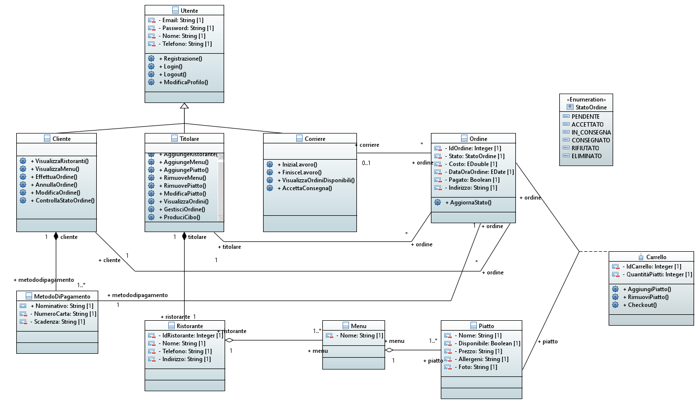
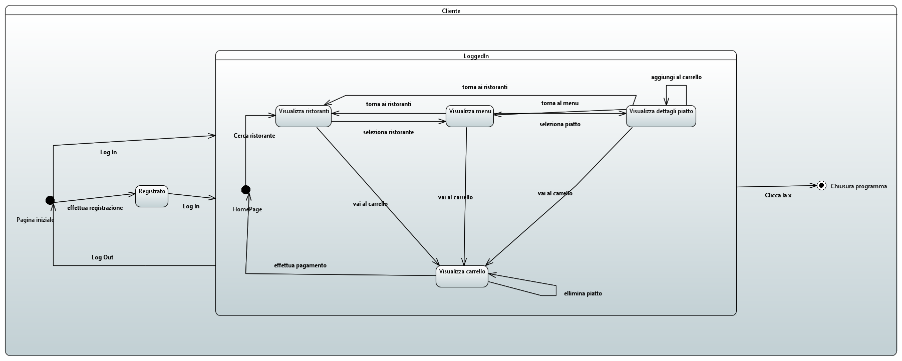
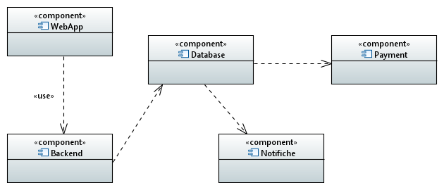
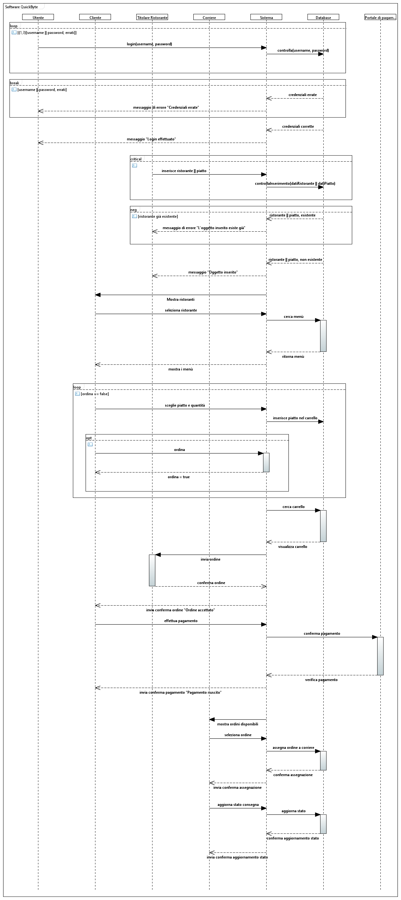
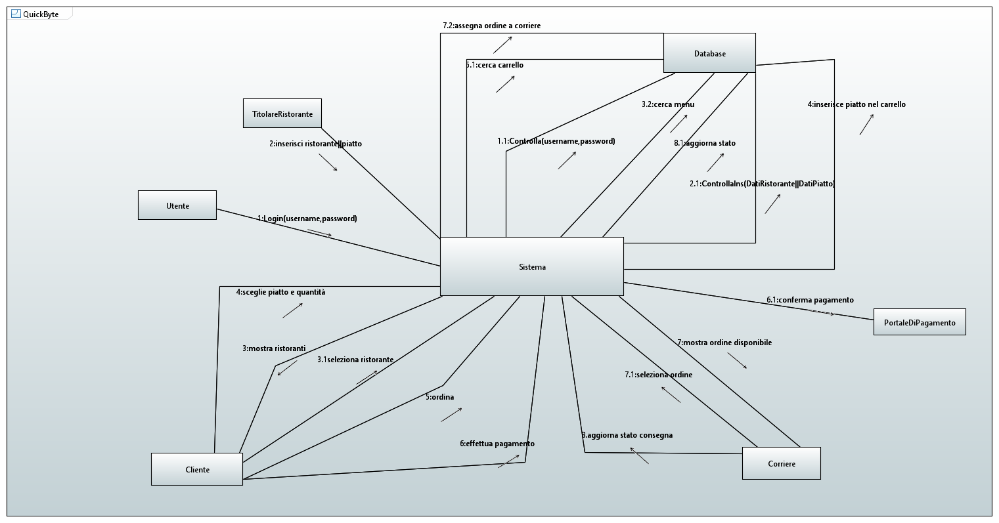
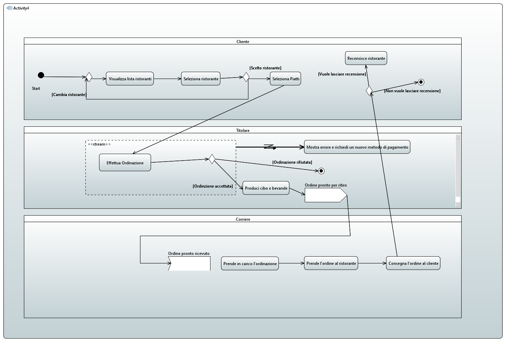
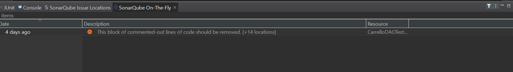
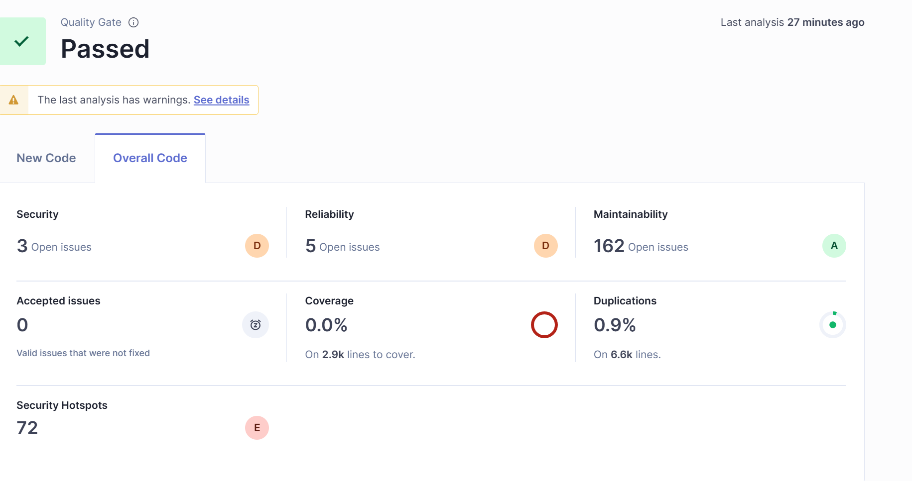

**DOCUMENTO 4: DESIGN**

**1)Software Architecture**

L’architettura del nostro sistema si basa su un’architettura Cliente-server con una chiara separazione tra la logica e l’interfaccia utente, secondo il pattern Model-View-Controller (MVC).

1.1) **Architectural Views**
- **Logical View:** che descrive il sistema in termini di elementi di progettazione principali e delle loro interazioni:

Diagramma di classe

Diagramma di stato

Component Diagram

- **Process View**: che descrive la struttura dinamica del sistema in termini di attività, processi, loro comunicazione e allocazione di funzionalità agli elementi di runtime;

  

Diagramma di sequenza

Diagramma di comunicazione

Diagramma di attivita

1.2) **stile architetturale**

adottiamo uno stile architetturale a stratti che prevede la suddivisione del sistema del sistema in livelli distinti per separare le responsabilità e semplificare la manutenzione:

- livello di interfaccia
- livello logico
- livello di database

1.3) **Libreria esterna con Maven**

Nel progetto, usiamo librerie esterne con Maven:

- MySQL Connector
- Junit per i test

**2) Software Design**

**2.1) Design pattern**

Nel nostro software usiamo i seguenti design pattern:

- MVC: per la separazione tra la logica e l'interfaccia utente
- Singleton: Utilizzato per la gestione della connessione al database, garantendo un'unica istanza condivisa.

**2.2) Misurazione del codice: (Da riportare i screenshot)**

Per garantire la qualità del codice, usiamo strumenti di analisi:

- JDepend: per analizzare le dipendenze tra pacchetti.
  ([report](./reports/jdepend-report.xml))

- SonarLint per identificare potenziali problemi di qualità e complessità (fornisce feedback direttamente nell’IDE).

- SonarQube per analizzare metriche di qualità, code smells, vulnerabilità.

  

Quality Gate(Passed): Il codice ha superato i controlli minimi richiesti da SonarQube
Security(3 Open Issues): sono vulnerabilità potenziali nel codice nuovo.
Reliability(5 Open Issues): sono Bug che potrebbero causare crash o comportamenti inaspettati.
Maintainability(162 Open Issues) sono "Code smells" che rendono il codice difficile da mantenere.
Duplications(0.9%): Una piccola parte del codice è duplicata.
Security Hotspots(72): sono Aree del codice che potrebbero nascondere vulnerabilità, ma richiedono una revisione manuale.

