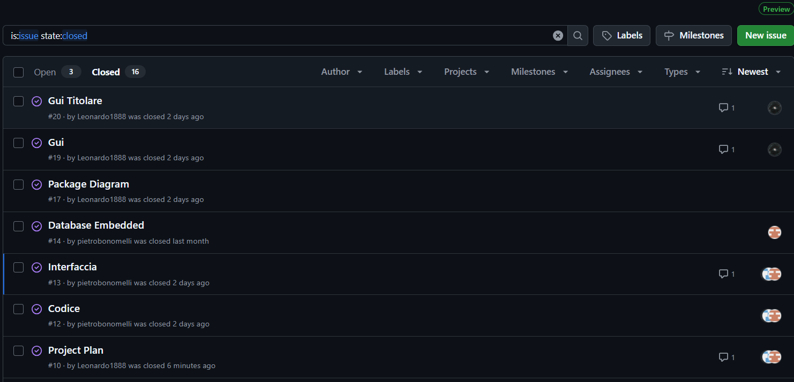
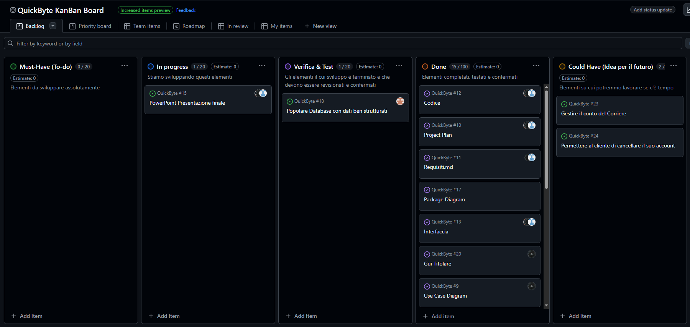

# Capitolo 3: Software Life Cycle

Il modello del ciclo di vita che adottiamo è il **Rational Unified Process (RUP)**, Strutturiamo le sue fasi:

### 1. La fase iniziale:
Le principali attività di questa fase sono:
- Identificazione degli stakeholder
- Raccolta dei requisiti principali
- Analisi di fattibilità
Output: Modelli dei casi d’uso principali. 

### 2. La fase di elaborazione: 

Le principali attività di questa fase sono:
- Progettazione dell’architettura del software
- Pianificazione dettagliata.

Output: Modello architetturale, Modelli UML

### 3. La fase di costruzione:
Le principali attività di questa fase sono:
- Sviluppo del software
- Test continuo
- Gestione della configurazione tramite github

Output: Versione funzionante del software.

### 4. La fase di transizione
Le principali attività di questa fase sono:
- Test finale con simulazioni reali
Output: Versione stabile del software, documentazione completa.

Oltre al modello RUP, seguiremo anche un approccio Model Driven Architecture (MDA), in particolare generiamo automaticamente porzioni di codice tramite Papyrus.
Per lo schema del Database: Generiamo uno Script SQL per la creazione delle tabelle del Database dal diagramma UML delle Classi.

Adottiamo un'organizzazione di sprint flessibile, senza un periodo di tempo fisso, con un meeting alla fine di ogni sprint:

| Fase          | Attività      | Data         |
| ------------- | ------------- | -------------
| 1  | Inizio: analisi requisiti, documentazione del SW generale e consegna project plan | 01/11/2024 - 06/01/2025
| 2  | Completamento quasi totale della progettazione e terminazione UML  | 10/01/2025 - 17/01/2025
| 3  | Creazione codice con Papyrus, creazione del database | 18/01/2025 - 23/01/2025
| 4  | Inizio scrittura codice, creazione interfaccia grafica basilare e integrazione del Database  | 25/01/2025 - 04/02/2025
| 5  | Sviluppo codice  | 04/02/2025 - 14/02/2025
| 6  | Verifica e testing  | 14/02/2025 - 16/02/2025
| 7  | Analisi qualità  | 16/02/2025 - 19/02/2025
| 8  | Presentazione PPT e completamento documentazione  | 19/02/2025 - 24/02/2025

	

# Capitolo 4: Configuration Managment 
Per la gestione della configurazione del software utilizziamo GitHub, che ci permette di tenere traccia delle modifiche al codice, collaborare in modo efficace e mantenere un flusso di lavoro organizzato.

Strumenti Utilizzati:
- Git: Sistema di versionamento distribuito.
- GitHub: Repository remoto per la collaborazione e il monitoraggio del codice.
- GitHub Issues: Per la gestione dei problemi e delle nuove funzionalità.
- GitHub Projects (Kanban Board): Per organizzare le attività e il progresso del progetto.
Workflow di Versionamento
- Seguiamo una strategia di branching basata sul modello Git Flow, con il ramo *main* come ramo principale
    - main: Contiene solo le versioni stabili e rilasciate del software.
    Ogni modifica al codice deve essere associata a un commit chiaro e descrittivo.
    - Le modifiche devono passare attraverso pull request per garantire revisione e qualità del codice.
    - Ogni merge in main di un altro branch su cui si è sviluppato il software richiede l'approvazione di almeno un altro membro del team.

I nostri issues:

Pull request:

# Capitolo 5: People Management and Team Organization
Il team è composto da 3 persone: **Anes Hamza, Bonomelli Pietro, Rota Leonardo.** è un team che si basa sugli approcci agili, quindi è una squadra agile, senza gerarchie interne ed è un team Cross-Funzionale cioè ogni membro del team può assumere più ruoli (sviluppatore, tester…). I membri del team sono a stretto contatto con canali di comunicazione non formali.

Durante le riunioni, si possono assegnare alcuni compiti ai membri del team, ma ogni membro del team può modificare aiutando gli altri membri del team qualora abbia portato a termine i suoi compiti.

#### KanBan Board

Per organizzare e monitorare il flusso di lavoro, utilizziamo una **Kanban board** su GitHub Projects. Questo strumento ci consente di:

- Visualizzare lo stato delle attività:
    - To-do, in progress, Verfica&Test, Done, Could-Have (idee per il futuro).
- Assegnare task ai membri del team.
- Tracciare le issue aperte e le pull request.

Ecco un esempio della nostra KanBan Board:

---

*Data di creazione: 10/12/2024 \
Ultima modifica: 17/03/2025*
