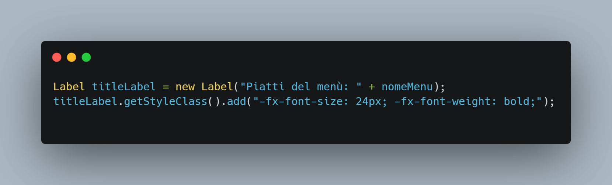
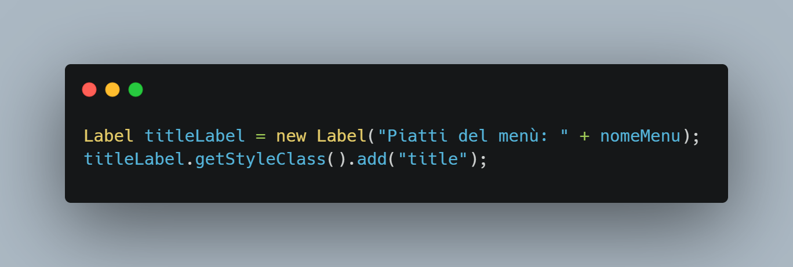
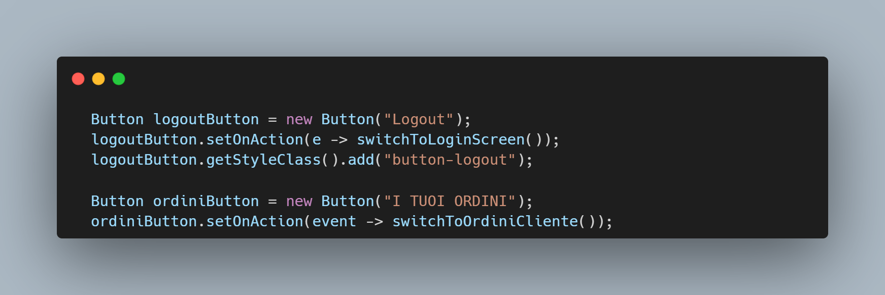
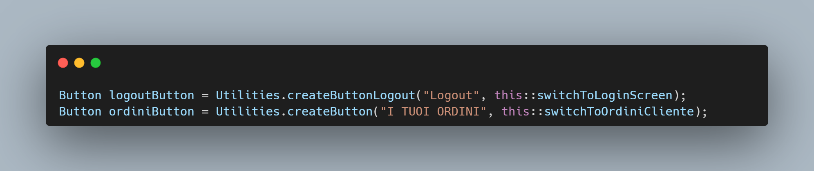
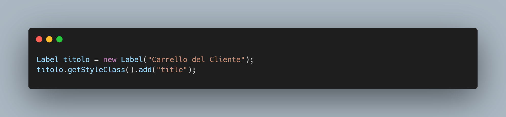
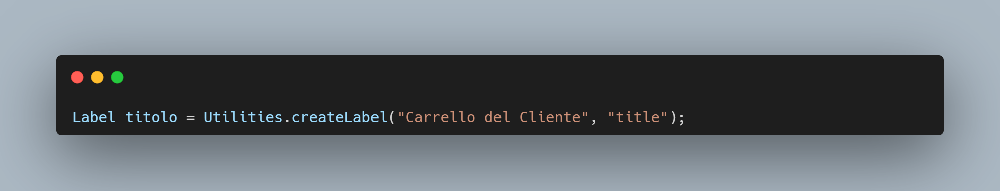
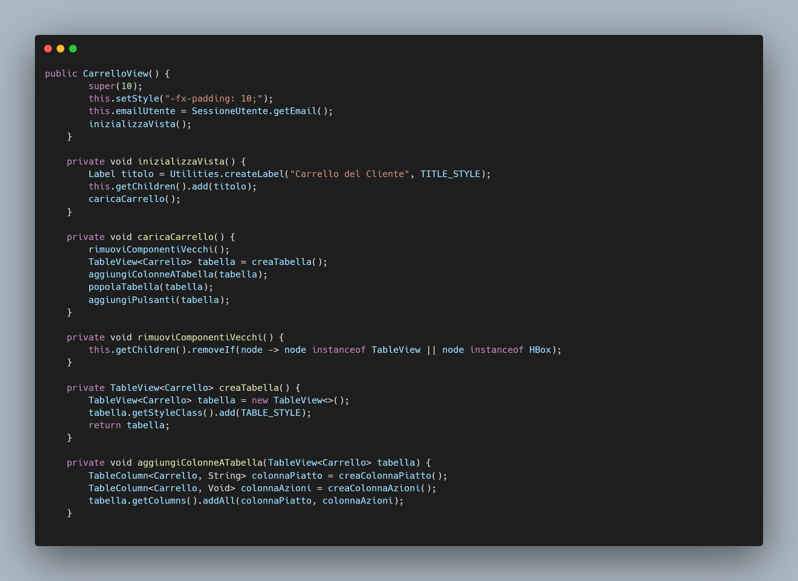
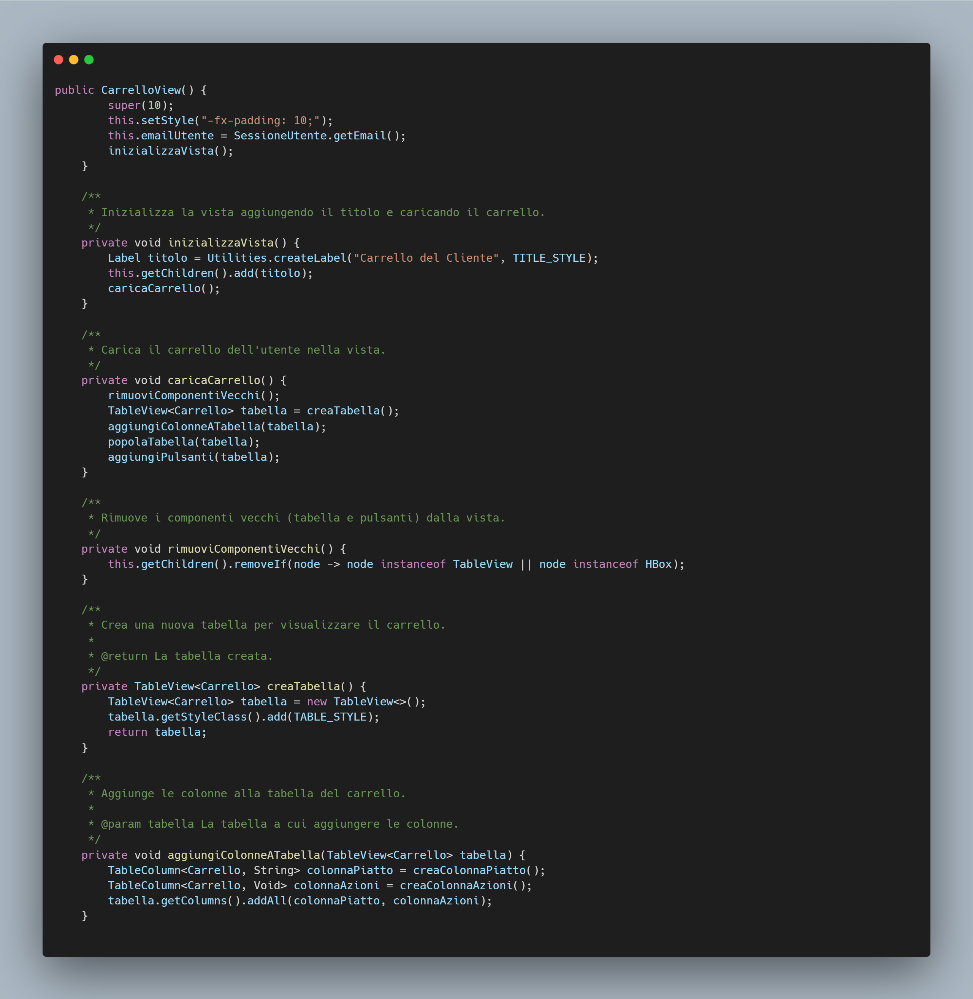

**Software Maintenance**

**Introduzione**

Questo documento descrive le attività di manutenzione svolte sul progetto evidenziando eventuali operazioni di refactoring effettuati.

**1)Attività di refactoring**

Diverse attività di refactoring sono state eseguite per migliorare la qualità del codice, ridurre la complessità e ottimizzare le prestazioni del software.

Esempi:

## 1. Utilizzo di css per rendere il codice più leggibile.

## 2. Creare metodi per impostare gli elementi per evitare la duplicazione del codice

## 3. Scomposizione dei metodi in metodi più piccoli

## 4. Aggiunta di commenti

