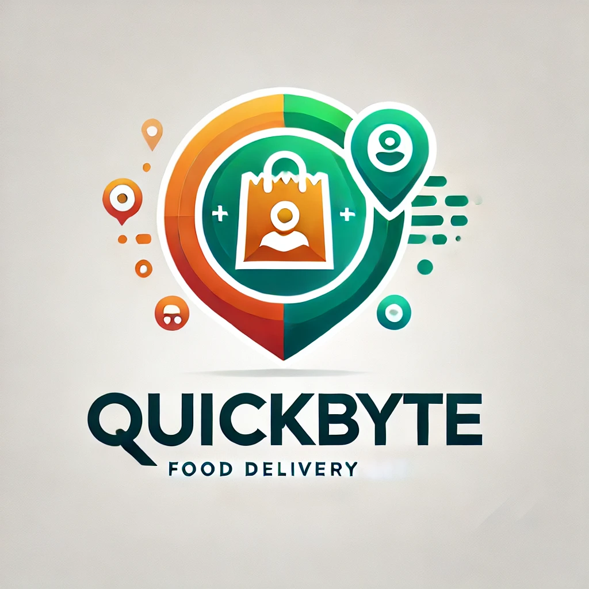

  

Project Plan di sviluppo del software: QuickByte, un’applicazione per la gestione di ordini di cibo a domicilio, che collega: ristoranti, clienti e corrieri attraverso un'interfaccia intuitiva.

Sviluppato da:
- Anes Hamza, 1086081
- Bonomelli Pietro, 1087035
- Rota Leonardo, 1086029

 

# INDICE
1. [Introduzione](#1-introduzione)
2. [Modello di processo](#2-modello-di-processo)
3. [Organizzazione del progetto](#3-organizzazione-del-progetto)
4. [Standard, linee guida, procedure](#4-standard-linee-guida-procedure)
5. [Attività di gestione](#5-attività-di-gestione)
6. [Rischi](#6-rischi)
7. [Personale](#7-personale)
8. [Metodi e tecniche](#8-metodi-e-tecniche)
9.  [Garanzia di qualità](#9-garanzia-di-qualità)
10. [Pacchetti di lavoro (workpackages)](#10-pacchetti-di-lavoro-workpackages)
11. [Risorse](#11-risorse)
12. [Budget e programma](#12-budget-e-programma)
13. [Cambiamenti](#13-cambiamenti)
14. [Consegna](#14-consegna)

## 1. Introduzione TODO
Durante l’anno 2024, un team di tre studenti di Ingegneria Informatica decide di sviluppare un’applicazione per la gestione di un sistema software di delivery food, per via della scarsa presenza di prodotti simili sul mercato.

L’obiettivo del progetto è quello di sviluppare una piattaforma che permetta all’utente, che può essere di tipo: cliente, titolare di un ristorante o corriere, rispettivamente di: effettuare ordini, ampliare le modalità di vendita o guadagnare completando consegne.
Il team di sviluppo è composto da 3 partecipanti: Anes Hamza, Bonomelli Pietro e Rota Leonardo.

-TODO: conclusioni-

## 2. Modello di processo
Il modello del ciclo di vita che verrà usato è il Rational Unified Process (RUP).
È un modello iterativo che può essere considerato come una via di mezzo tra i metodi basati su documenti tramite lo sviluppo agile. Non è stato scelto un modello puramente agile per la necessità di avere una documentazione corretta e soprattutto completa, tenendo quindi conto anche di un'asse temporale.
Dividiamo perciò il ciclo di vita del software nelle 4 fasi del RUP: (fonte wikipedia)

- Fase iniziale: si concentra sull’ottenimento di obiettivi chiari. Questo include la pianificazione iniziale del progetto, la [valutazione dei rischi](#6-rischi) ed una definizione grossolana dei requisiti. Se il progetto non supera questa milestone, detta "Lifecycle Objective Milestone", dovrà essere ridefinita questa fase per procedere alla successiva.

- Fase di elaborazione: nella quale verranno portati a termine questi punti fondamentali:
deve essere stato sviluppato un modello dei casi d'uso parzialmente completo
dev'essere fornita la descrizione dell'architettura del sistema e questa deve essere sviluppata ed eseguibile, in modo che dimostri il completamento degli use case significativi
dev'essere completata una pianificazione del progetto complessivo

- Fase di costruzione: durante questa fase viene sviluppato gran parte del progetto. Viene prodotta la prima versione del sistema. 
La milestone di questa fase viene chiamata "Initial Operational Capability" e rappresenta la prima forma funzionale del sistema.

- Fase di transizione: il sistema passa dall'ambiente dello sviluppo a quello del cliente. Vengono condotte alcune attività tra cui il beta testing del sistema a scopo di verifica e validazione. Viene verificato che il prodotto è conforme alle aspettative descritte nella fase iniziale. Qualora i requisiti descritti nella prima fase non fossero soddisfatti, si procederà a ripetere l'intero ciclo. In caso contrario, si raggiunge la milestone detta "Product Release" e lo sviluppo del software termina.

Oltre al modello **RUP**, seguiremo anche un approccio **Model Driven Architecture (MDA)**, in particolare progetteremo diagrammi UML tramite il plugin Papyrus installato sulla macchina virtuale Eclipse, ambiente di sviluppo che utilizziamo per scrivere codice Java.

## 3. Organizzazione del progetto:
Il team di sviluppo si interfaccerà con i professori che seguono lo sviluppo dell’applicazione.
Non essendoci utenti, non ci sarà interazione con degli utenti. Verrà sviluppato il software di cui, dopo la prima fase di implementazione, verrà presentata una versione di prova e testeremo noi stessi se stiamo seguendo le linee guida e gli obiettivi che c’eravamo posti, quindi una verifica e validazione dopo ogni fase da parte dei programmatori.

**Ruoli:**

essendo in tre sviluppatori i ruoli saranno di tipologia Agile: non esiste una gerarchia specifica, ergo è necessaria un’adeguata autodisciplina ed un’ottima capacità di adattamento.
Tutti gli esperti del team devono essere versatili in quanto dovranno svolgere le diverse funzioni necessarie (progettazione, sviluppo, testing, ecc.). 
La comunicazione sarà tempestiva e poco formale tra i membri del team e la documentazione moderatamente formale.

Conoscenze richieste minime: programmazione Java, uso della lingua italiana.

## 4. Standard, linee guida, procedure
All’interno del progetto è necessario che ogni membro segua determinati standard e linee guida, in modo tale che il progetto sia di semplice comprensione per tutti i membri del team, e quindi facilitare la manutenibilità.

#### 4.1 Standard di codifica
Per garantire leggibilità e manutenibilità del codice, adottiamo le seguenti convenzioni, che sono le classiche di Oracle per Java:

- Nomi delle variabili:
	- Variabili globali in MAIUSCOLO.
	- Variabili locali in camelCase (evitando gli underscore).
	- Nomi dei metodi in camelCase, presenti di commento che descrive lo scopo del metodo.
	- Costanti: dichiarate come static final e in MAIUSCOLO con underscore per separare le parole.
- Indentazione: "tab" per ogni livello di indentazione.
- Commenti:
	- Commenti inline (//) per spiegare logiche.
	- Commenti Javadoc per documentare classi, metodi e interfacce pubbliche.
#### 4.2 Linee guida per la documentazione:
- La documentazione sarà esaustiva e aggiornata regolarmente su documenti tramite GitHub.
- Lingua: italiano, tecnico per quanto possibile, l'importante è che sia comprensibile.
- Struttura: Ogni documento deve includere un'intestazione, data di creazione e ultima modifica.
- Qualora un punto nella documentazione venga cancellato evitare di scalare tutti gli altri punti per evitare incongruenze.

#### 4.3 Procedure di gestione del codice
- Il codice sorgente sarà gestito attraverso una repository GitHub, seguendo queste pratiche:
- Branching:
	- Branch principale (main) per versioni stabili.
	- Branch secondari per lo sviluppo di nuove feature che non sono ancora pienamente funzionanti
- Commit:
	I commit devono avere un nome chiaro e se necessario una descrizione esaustiva di cos'è stato implementato.
- Pull request:
	- Ogni modifica al codice deve passare attraverso una pull request, da sottoporre a revisione da parte almeno di un altro membro del team per verificare che sia funzionante e priva di errori che rendando il codice non eseguibile.
#### 4.4 Standard di design
- Progettazione modulare con un chiaro separazione tra:
	- Modello: Gestione dei dati e delle interazione con il database.
	- Controller: coordinatore tra Modello e Vista, per separare FrontEnd e BackEnd.
	- Vista: Interfaccia utente, realizzata con Java Swing o SWT.
	- Database: Embedded, con struttura progettata lo schema ER.
	- Diagrammi UML:
		- Diagramma dei casi d'uso per definire le principali funzionalità del sw.
		- Diagramma delle classi per descrivere l'architettura del codice.
		- Diagrammi di sequenza per rappresentare i flussi di interazione tra i vari componenti.
		
#### 4.5 Procedure di testing 
Durante tutte le fasi di sviluppo, saranno svolti test per garantire la qualità del software:

- Test unitari: Verifica delle singole componenti (funzioni, moduli, ecc.).
- Test d’integrazione: Controllo del corretto funzionamento tra frontend, backend e i file che compongono il database..
- Test di sistema/accettazione: simulazione dell'applicazione inserendo dati reali, simulato da noi studenti, nell'ambiente finale.

#### 4.6 Procedure di comunicazione
- Riunioni settimanali tramite Discord o Google Meet per aggiornamenti.
- Documentazione delle decisioni principali in un file .doc condiviso su Google Drive.

## 5. Attività di gestione
Organizzeremo brevi riunioni con cadenza aperiodica per analizzare lo stato di avanzamento del progetto, producendo un breve report come output.
Questa fase sarà gestita utilizzando anche GitHub, con cui verrà moinitorato lo sviluppo delle classi Java.
Utilizzeremo una metodologia MoSCoW tramite una board condivisa, il che permetterà di evidenziare rapidamente qual è la prossima task da eseguire.

## 6. Rischi
#### 6.1: Mancanza di un membro del team a causa di altri impegni (es. corsi universitari).
Soluzione: Adottare un'organizzazione del lavoro flessibile e documentare tutte le decisioni prese durante le riunioni. Inoltre, assegnare backup temporanei per i compiti critici.
#### 6.2 Possibili difficoltà con tecnologie e framework nuovi.
Soluzione: Investire nell'autoformazione, consultare documentazione ufficiale e risorse online, ed eventualmente suddividere il lavoro per sfruttare l'expertise di ciascun membro.
#### 6.3 Possibile comportamento diverso del sito web su vari browser
Soluzione: Testare il codice su una varietà di browser e sistemi operativi fin dalle prime fasi di sviluppo per identificare problemi di compatibilità.
#### 6.4 Ritardi nella consegna delle milestone
Soluzione: Adottare una gestione Agile, monitorando costantemente lo stato di avanzamento del progetto.
Vulnerabilità nel sistema di autenticazione o nelle transazioni di pagamento.
Soluzione: Implementare buone pratiche di sicurezza, come la crittografia dei dati.
#### 6.5 Comunicazione inefficace all’interno del team
Soluzione: Utilizzare strumenti di gestione del progetto e pianificare meeting settimanali per aggiornamenti.
#### 6.6 Bug non rilevati durante la fase di test
Soluzione: Ampliare i casi di test, coinvolgere beta tester esterni.
Scarsa accettazione da parte degli utenti finali
#### 6.7 L’app potrebbe non soddisfare le aspettative degli utenti finali, in quanto potrebbe non risultare chiara e/o intuitiva.
Soluzione: Coinvolgere più utenti e beta tester, affinché aiutino a mettere luce sui problemi dell’applicazione, nelle fasi di prototipazione e raccolta di feedback continuo.

## 7. Personale
Nel nostro team non esiste una gerarchia specifica, quindi tutti e tre gli sviluppatori copriranno tutti i ruoli durante le varie fasi del progetto. Vedi i punti [6.1](#61-mancanza-di-un-membro-del-team-a-causa-di-altri-impegni-es-corsi-universitari) e [6.6](#66-bug-non-rilevati-durante-la-fase-di-test) per eventuali rischi.

## 8. Metodi e tecniche
**8.1 Metodologie di sviluppo**
Adottiamo un approccio iterativo e incrementale, basato sul Rational Unified Process (RUP), vedi [qui](#2-modello-di-processo). Questo metodo ci consente di gestire il progetto con cicli iterativi, migliorando la flessibilità e la verifica dei risultati.

**8.2 Strumenti**
IDE: Eclipse 2024-09 con Maven per la gestione delle dipendenze.
Modellazione UML: Papyrus.
Versionamento: GitHub.

**8.3 Testing**
Realizziamo test unitari, di integrazione e di sistema in modo iterativo, utilizzando framework come JUnit, questo per garantire la qualità del software in tutte le fasi dello sviluppo.\
\
OS utilizzati per lo sviluppo (su cui verranno effettuati test): 
- Windows 10
- Windows 11
- Ubuntu 24.04

## 9. Garanzia di qualità
(Quale organizzazione e procedure verranno utilizzate per garantire che il software in fase di sviluppo soddisfi i requisiti di qualità dichiarati?
I molti aspetti di un Piano di Assicurazione della Qualità possono anche essere trattati in un documento separato. Il tema della garanzia della qualità è discusso nel Capitolo 6.)

#### 9.1 Best practice nella codifica - Vedi punto 4: [Standard di codifica](#41-standard-di-codifica)

#### 9.2 Testing - Vedi punto 4: [Procedure di testing](#45-procedure-di-testing)

#### 9.3 Documentazione
Aggiornamento continuo della documentazione in modo tale che sia sempre allineata allo sviluppo.
Manuale utente abbastanza dettagliato per facilitare il futuro l’utilizzo del software. [Vedi Documentazione.](#42-linee-guida-per-la-documentazione)

#### 9.4 Verifica e validazione
Ogni iterazione sarà sottoposta a verifica interna per accertarsi che i risultati siano conformi a quelli stabiliti in  partenza.

## 10. Pacchetti di lavoro (workpackages)
#### Documentazione 
- Redazione del Project Plan [vedi punto 14 per la consegna](#14-consegna).
- Aggiornamento continuo per allineare il progetto con le modifiche approvate.

#### Progettazione
- Progettazione dell’architettura software (definizione delle componenti principali e delle interazioni tra di loro).
- Progettazione del database (Schema ER, File csv embedded, Costruzione del database embedded).

#### Programmazione Backend
- Gestione dell’autenticazione e dei ruoli (clienti, ristoranti, corrieri, utenti).
- Implementazione delle funzionalità principali. Per esempio: Registrazione utenti, gestione ordini.
- integrazioni con il database.

#### Programmazione GUI
- Sviluppo dell’interfaccia utente per gli utenti che ne faranno uso.
- Realizzazione di pagine intuitive.

#### Testing - [Vedi Testing](#45-procedure-di-testing)

## 11. Risorse
Risorse hardware:
- PC laptop
- Connessione wi-fi

[Vedi qui](#8-metodi-e-tecniche) gli strumenti software usati. (GitHub, Google Drive, Eclipse, ecc.)

## 12. Budget e programma
Nello sviluppo del software non è previsto un budget economico specifico, ma è importante avere una stima dei tempi in modo accurato. Questo perché il progetto ha una scadenza fissata per gennaio 2025, con l’attività iniziata a novembre 2024.

La stima dei tempi sarà quindi uno strumento essenziale per garantire il rispetto della deadline, suddividendo il lavoro in fasi ben definite e monitorando costantemente lo stato di avanzamento.

## 13. Cambiamenti
**Registrazione delle modifiche proposte:** Ogni modifica deve essere documentata su un file condiviso, specificando il perché è stato modificato e la ragione della proposta.

**Revisione e approvazione:** Le modifiche proposte saranno discusse durante le riunioni del team, e approvate solo dopo aver valutato se la modifica è necessaria e se soddisfa i requisiti.

**Stima dell’impatto:** Una volta approvata, la modifica sarà brevemente analizzata in termini di tempi di implementazione e impatti sulle funzionalità già esistenti, e quindi sulle qualità del software, per capire se vi è tempo e margine per implementarla.

**Implementazione controllata:** La modifica verrà incorporata nel progetto seguendo le procedure definite, assicurandosi che sia accompagnata da:
- Aggiornamenti al codice con commenti chiari.
- Modifica della documentazione correlata.
- Test per garantire che non vengano introdotti bug.

**Versionamento e controllo della configurazione:** Per gestire le diverse versioni di codice e documentazione si userà GitHub, che consentirà di tenere traccia dei cambiamenti e di ritornare a una versione stabile in caso di problemi, e quindi ridurre i [rischi](#6-rischi) in caso di guasto ad un hardware.

## 14. Consegna 
Il Project Plan, che include la pianificazione dettagliata, la gestione dei rischi e dei cambiamenti, deve essere consegnato al principale stakeholder, il professor Gargantini, almeno un mese prima della consegna finale del progetto.

Prima della consegna definitiva, il sistema sarà sottoposto a:
**Test di accettazione** (User Acceptance Testing) per verificare se sono soddisfatti i requisiti, **Unit test**

Verrà consegnata al cliente una **documentazione completa e accurata**, includendo: Manuale utente e il Registro delle modifiche effettuate durante lo sviluppo.

I documenti consegnati devono contenere:
- Project Plan, 
- SW life cycle,
- Configuration management,
- People Management and Team Organization,
- Software Quality,
- Documento sui requisiti,
- UML,
- Descrizione sull’architettura,  
- Design del SW,
- Test effettuati sul SW,
- Refactoring/documentazione sulla manutenzione del sw.

# Note varie: APPUNTI

	Repository seria su github
	
	Documentazione
	
	Progetto Maven su eclipse
	
	UML almeno 1 per tipo (papirus)
	
	DB (facoltativo) deve essere embedded
	
	Parte GUI (facoltativa): java swing o java swt, OPPURE pagina web con java server pages o vaadin

---
*Data di creazione: 06/11/2024 \
Ultima modifica: 05/12/2024*
