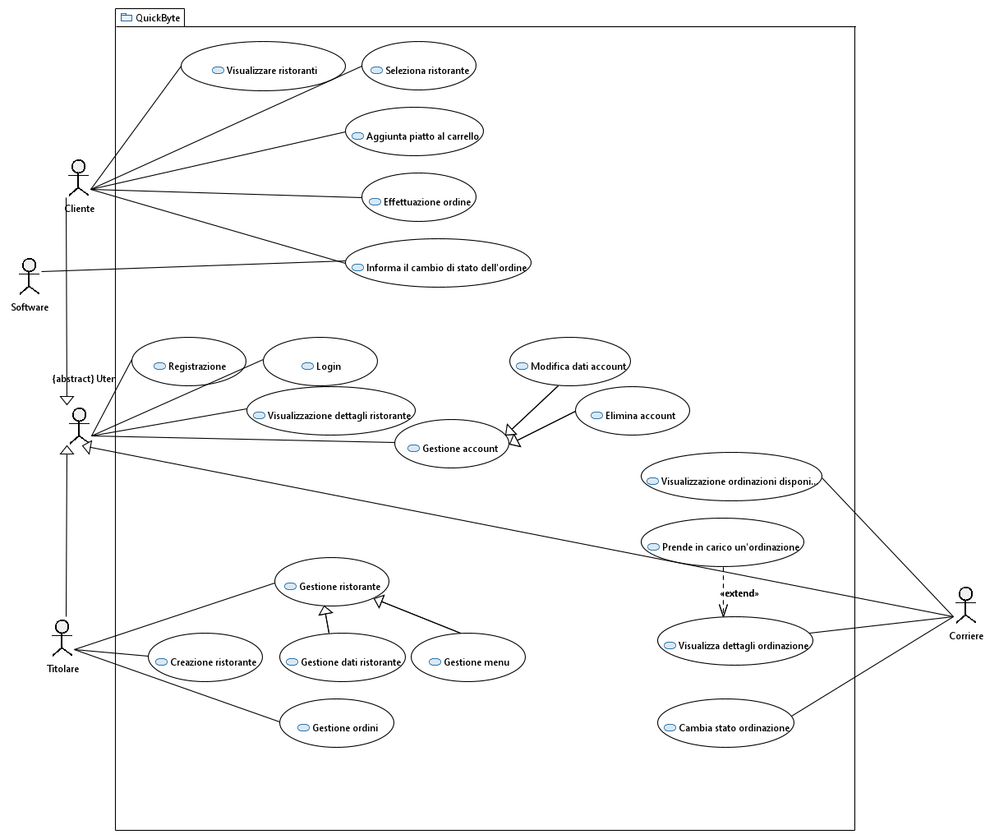

# Requisiti

## Software Quality (Capitolo 6)

Per garantire che il software soddisfi le aspettative degli utenti e sia in grado di adattarsi a futuri scenari d'uso, implementiamo alcune Caratteristiche e metriche di qualità del software definite dallo Standard ISO 9126:

- **Affidabilità**: Per il nostro sistema, l'affidabilità è particolarmente critica nel processo di gestione degli ordini e del pagamento. Devono essere garantiti:
  - L'elaborazione corretta degli ordini senza perdita di dati.
  - La sicurezza e il completamento delle transazioni di pagamento.
- **Usabilità**: Per il nostro progetto adottiamo questa definizione per tre tipi di utente:
  - **Clienti**: L'interfaccia utente deve essere intuitiva e user-friendly.
  - **Ristoranti**: La gestione degli ordini deve essere semplice e non richiedere competenze tecniche.
  - **Corrieri**: Le operazioni per accettare e consegnare ordini devono essere immediate.
- **Efficienza**: I tempi di risposta devono essere rapidi per garantire una buona esperienza utente, specialmente durante la ricerca di ristoranti o il tracciamento degli ordini in tempo reale.
- **Portabilità**: Il prodotto software deve essere trasferibile da un ambiente all'altro. Il nostro sistema deve essere compatibile con browser web su desktop e dispositivi mobili.

## Requirement Engineering (Capitolo 9)

### 9.1 Elicitazione dei requisiti

Le tecniche utilizzate sono:
- **Interviste con gli utenti**, specialmente con i titolari di ristoranti per capire le loro aspettative e il flusso operativo.
- **Derivazione da un sistema esistente**: abbiamo analizzato piattaforme simili per identificare best practice e funzionalità chiave.

### 9.2 Specifica dei requisiti

Seguendo lo standard IEEE 830:

#### 1. Introduzione
- **1.1. Obiettivo**: Definire i requisiti per una piattaforma di gestione ordini e consegne.
- **1.2. Scopo**: Sviluppare un sistema software per una gestione efficiente e integrata di ordini e consegne, migliorando l’esperienza degli utenti tramite un’interfaccia web.
- **1.3. Definizioni, acronimi e abbreviazioni**
  - 1.3.1. Utente: Può indicare cliente, titolare di ristorante o corriere.
- **1.4. Riferimenti**
  - 1.4.1. Lo standard IEEE 830.
- **1.5. Panoramica**
  - 1.5.1. La sezione 2 definisce il sistema in generale.
  - 1.5.2. La sezione 3 dettaglia i requisiti.

#### 2. Descrizione generale

- 2.1. Prospettiva del prodotto: Il sistema è un’applicazione web multi-utente per connettere clienti, ristoranti e corrieri.

- 2.2. Funzioni del prodotto
    - 2.2.1. Registrazione e autenticazione degli utenti.
    - 2.2.2. Creazione, modifica e gestione degli ordini.
    - 2.2.3. Gestione dei menu da parte dei ristoranti.
    - 2.2.4. Visualizzazione e accettazione delle consegne da parte dei corrieri.

- 2.3. Caratteristiche dell'utente
    - 2.3.1. **Cliente**: Navigare tra i ristoranti, visualizzare menu, effettuare ordini e visualizzare lo stato.
    - 2.3.2. **Titolare**: Gestire i menu, visualizzare e gestire gli ordini.
    - 2.3.3. **Corriere**: Visualizzare e accettare consegne disponibili, aggiornarne lo stato.
- 2.4. Vincoli
- 2.5. Presupposti e dipendenze

#### 3. Requisiti specifici

3.1. Requisiti dell'interfaccia esterna
- 3.1.1. **Interfacce Utente**: Tre interfacce (cliente, ristoranti, corrieri).
- 3.1.2. **Interfacce hardware**: Compatibilità con dispositivi e browser diversi.
- 3.1.3. **Interfacce software**: Integrazione con un gateway di pagamento e notifiche push.
- 3.1.4. **Interfacce di comunicazione**: Uso del protocollo HTTPS per garantire sicurezza.

3.2 Richieste funzionali

- 3.2.1. **Cliente** può:
  - Creare un account Cliente fornendo nome, email, password e numero di telefono.(MUST HAVE)
  - Modificare il suo account (con possibilità di cancellarlo).(COULD HAVE)
  - Visualizzare la lista dei ristoranti disponibili.(MUST HAVE)
  - Cliccare su un ristorante.(MUST HAVE)
  - Visualizzare i dettagli del ristorante (menu con lista dei piatti e rispettivi prezzi, orari di apertura, valutazione media, recensioni).(MUST HAVE)
  - Aggiungere i piatti al carrello specificando la quantità.(MUST HAVE)
  - Effettuare un ordine inserendo i dati della carta (con la possibilità di decidere di memorizzare il metodo di pagamento) e l'indirizzo(da inserire ogni volta). (MUST HAVE) 
  - Riceve la conferma che l'ordine è stato accettato dal ristorante.(SHOULD HAVE)
  - Riceve la conferma che l'ordine è stato preso in carica dal corriere.(SHOULD HAVE)
  - Monitorare lo stato dell’ordine.(SHOULD HAVE)
  - Recensire il ristorante da cui ha acquistato.(COULD HAVE)
  - Eliminare il proprio account dalla piattaforma.(COULD HAVE)
- 3.2.2. **Titolare** può:
  - Creare un account Titolare fornendo nome, email, password e numero di telefono.(MUST HAVE)
  - modificare il suo account (con possibilità di cancellarlo).(COULD HAVE)
  - Creare e modificare il ristorante aggiungendo i vari dati (menu con lista dei piatti e rispettivi prezzi, orari di apertura).(MUST HAVE)
  - Visualizzare e gestire ordini ricevuti (visualizzare contatti clientie, monitora stato ordine, accetta o rifiuta ordine).(MUST HAVE)
  - Visualizzare le recensioni riguardanti il ristorante.(COULD HAVE)
- 3.2.3. **Corriere** può:
  - Creare un account Corriere fornendo nome, email, password e numero di telefono.(MUST HAVE)
  - Modificare il suo account (con possibilità di cancellarlo).(COULD HAVE)
  - Dare la disponibilità se può prendere consegne in quel momento o meno.(COULD HAVE)
  - Visualizzare le consegne disponibili e selezionarne una.(MUST HAVE)
  - Visualizzare i dati inerenti all'ordinazione e i dati del cliente.(MUST HAVE)
  - Prendere in carica un'ordinazione.(MUST HAVE)
  - Aggiornare lo stato di una consegna (presa in carico, terminata).(SHOULD HAVE)

    

3.3 Requisiti di prestazione
- 3.3.1. Supportare 1'000 utenti simultanei senza degrado delle prestazioni.
- 3.3.2. Database con capacità di memorizzare almeno: 1'000 menu, 10'000 utenti, 1000 ristoranti.

3.4. Vincoli di progettazione
- 3.4.1. L’applicazione deve essere sviluppata in Eclipse.

3.5. Attributi del sistema software
- 3.5.1.	Affidabilità: il sistema deve garantire un uptime del 99%.
- 3.5.2.	Sicurezza: i dati sensibili degli utenti devono essere criptati.

3.6. Altri requisiti
- 3.6.1.	Il sistema deve essere in italiano.

---

*Data di creazione: 10/12/2024 \
Ultima modifica: 05/02/2025*
